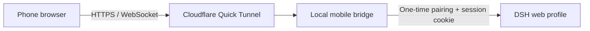
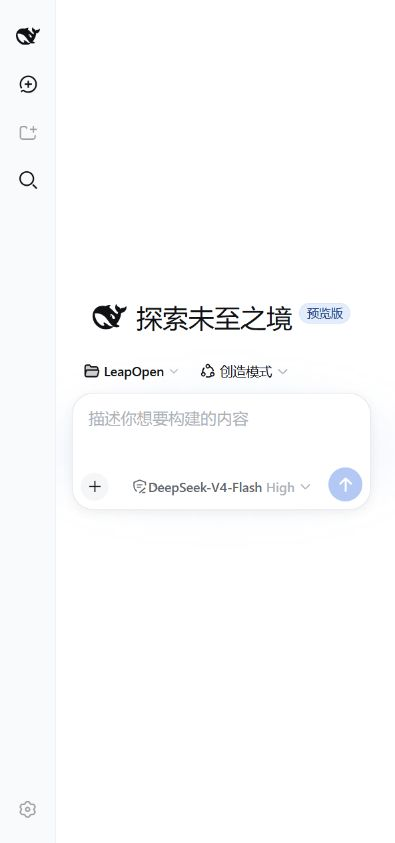

<p align="center"></p>

# DSH Mobile Web Remote

**Scan to connect. No mobile app, server, or public IP required.**

[](https://github.com/SnowfallC/dsh-mobile-web-remote/actions/workflows/compatibility.yml)

[简体中文](README.md) · [Installation](#installation) · [DSHFind](https://dshfind.com/)

DSH Mobile Web Remote adds temporary, authenticated mobile access to the DeepSeek Harness (DSH) web profile. It runs a small bridge on your computer and publishes that bridge through a Cloudflare Quick Tunnel. You do not need a VPS, domain, public IP, or router port forwarding. There is no Android app to install: scan the QR code and continue in the native DSH web interface.

> [!WARNING]
> This is an experimental feature. Cloudflare relays the traffic, and Quick Tunnel URLs are temporary. Do not use it for secrets, customer data, or other sensitive work. Revoke the link when you are done. For persistent deployments, use an auditable Named Tunnel and keep the plugin's authentication layer in place.

## What it changes

The plugin does not patch DSH source files, build artifacts, or the native workspace picker. It mounts through DSH's plugin composition, `webServer` routes, and `tapIndex` extension point. The desktop page gets one floating button; the phone receives the existing DSH web application through the protected bridge. Remove the plugin and restart DSH, and those additions disappear.

### Why it reuses the DSH web interface

DSH already runs as a web application. Its official interface defines sessions, message flow, tool state, language, and appearance. The remote plugin therefore delivers that same application to the phone through a protected bridge instead of maintaining a second client. This avoids UI drift and lets the mobile experience inherit official DSH interface and feature updates. The plugin remains responsible only for pairing, authentication, transport, and the few restrictions needed on a remote phone.

A compatibility workflow checks the latest DSH `main` every week. It installs the plugin into a real Web profile, then verifies desktop injection, the management page, one-time pairing, the session cookie, and remote restrictions. The workflow uses a local tunnel stand-in and never creates a public CI endpoint. If DSH changes its plugin manifest, Web extension points, or index delivery, the check should expose the small adapter surface that needs attention.



- The one-time pairing token stays in the URL fragment, so it is not sent with the first HTTP request or written to proxy logs.
- A successful pairing creates an `HttpOnly`, `SameSite=Strict` session cookie.
- HTTP and WebSocket traffic pass through the same authentication boundary. Forwarded Host and Origin values are restored for DSH's own browser checks.
- The bridge port and `cloudflared` process are stopped when DSH exits or unloads the plugin.
- If `cloudflared` is not installed, the plugin downloads the pinned official build for the current platform, verifies its SHA-256 digest, and caches it.
- The floating entry, dialog, and remote page follow DSH's language and light/dark appearance.
- “Add workspace” and “Settings” remain in their native positions but appear disabled on the remote page. Complete host configuration on the computer before continuing from the phone.

## Screenshots

<p align="center"></p>

The control stays inside the original DSH page instead of opening another tab:

<p align="center"></p>

After pairing, the phone renders the same DSH interface. **Add workspace** and the settings gear stay in their native positions but are visibly disabled:

<p align="center"></p>

## Installation

### Requirements

- A working DSH web profile.
- Node.js and pnpm, normally already present when running DSH from source.

You do not need to install `cloudflared` manually. The plugin uses an existing copy from `PATH` when available. Otherwise, it downloads and verifies an official Cloudflare release on first run, then reuses the local cache. The first run therefore needs access to GitHub Releases.

You do not need to provide a server, domain, or public IP. Cloudflare Quick Tunnel assigns a temporary HTTPS address at startup, and the plugin places that address and the one-time pairing data in the QR code.

### Install from GitHub

Run these commands from the DSH source repository:

```powershell
pnpm dsh plugin --profile web add "github:SnowfallC/dsh-mobile-web-remote"
pnpm dsh web
```

### Install from a local checkout

```powershell
git clone https://github.com/SnowfallC/dsh-mobile-web-remote.git
cd deepseek-harness
pnpm dsh plugin --profile web add "C:/path/to/dsh-mobile-web-remote"
pnpm dsh web
```

## Usage

1. Open DSH on the computer and click **Mobile remote** in the lower-right corner.
2. Wait for the Quick Tunnel and QR code to appear.
3. Scan the code with your phone's camera or browser. By default, the pairing link expires after 15 minutes and can be paired only once.
4. Open an existing workspace or session on the phone and continue the conversation.
5. Click **Revoke link** when finished. Revoke the current link before generating a fresh pairing code.

The local management page is also available at `http://127.0.0.1:3080/__dsh_mobile`.

## Configuration

Defaults live in `cordis.patch.yml`:

```yaml
config:
  cloudflaredPath: auto
  pairingTtlMinutes: 15
  sessionTtlHours: 12
  bridgePort: 0
```

With `bridgePort: 0`, the operating system chooses an unused local port. `cloudflaredPath: auto` checks the system command before installing the verified pinned build. Downloads are cached under `$DSH_HOME/cache/dsh-mobile-web-remote/cloudflared`. Set `cloudflaredPath` or `DSH_CLOUDFLARED_PATH` to use a specific executable instead.

## Uninstall

```powershell
pnpm dsh plugin --profile web remove dsh-mobile-web-remote
```

Restart DSH afterward. No patch is left in the DSH core repository.

## Development

```powershell
pnpm install
pnpm check
pnpm test
```

## Friendly link

- [DSHFind — an index of the DSH ecosystem](https://dshfind.com/)

Report security issues privately as described in [SECURITY.md](SECURITY.md). Do not place pairing URLs, tokens, or workspace data in a public issue.

## License

The code is released under the [MIT License](LICENSE). The [`cloudflared`](https://github.com/cloudflare/cloudflared) executable downloaded at runtime is published by Cloudflare under Apache-2.0 and is not part of this repository's MIT grant. The hero is an AI-assisted derivative of a community character and is also excluded; see [ASSET_LICENSE.md](ASSET_LICENSE.md).
