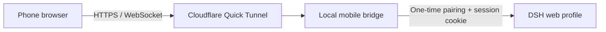

<p align="center"></p>

# DSH Mobile Web Remote

**Scan to connect—no mobile app required.**

[简体中文](README.md) · [Installation](#installation) · [DSHFind](https://dshfind.com/)

DSH Mobile Web Remote adds temporary, authenticated mobile access to the DeepSeek Harness (DSH) web profile. It runs a small bridge on your computer and publishes that bridge through a Cloudflare Quick Tunnel. There is no Android app to install: scan the QR code and continue in the native DSH web interface.

> [!WARNING]
> This is an experimental feature. Cloudflare relays the traffic, and Quick Tunnel URLs are temporary. Do not use it for secrets, customer data, or other sensitive work. Revoke the link when you are done. For persistent deployments, use an auditable Named Tunnel and keep the plugin's authentication layer in place.

## What it changes

The plugin does not patch DSH source files, build artifacts, or the native workspace picker. It mounts through DSH's plugin composition, `webServer` routes, and `tapIndex` extension point. The desktop page gets one floating button; the phone receives the existing DSH web application through the protected bridge. Remove the plugin and restart DSH, and those additions disappear.



- The one-time pairing token stays in the URL fragment, so it is not sent with the first HTTP request or written to proxy logs.
- A successful pairing creates an `HttpOnly`, `SameSite=Strict` session cookie.
- HTTP and WebSocket traffic pass through the same authentication boundary. Forwarded Host and Origin values are restored for DSH's own browser checks.
- The bridge port and `cloudflared` process are stopped when DSH exits or unloads the plugin.
- The floating entry, dialog, and remote page follow DSH's language and light/dark appearance.
- “Add workspace” and “Settings” are hidden remotely. Create or select a workspace on the computer before opening it from your phone.

## Screenshots

<p align="center"></p>

The control stays inside the original DSH page instead of opening another tab:

<p align="center"></p>

## Installation

### Requirements

- A working DSH web profile.
- Node.js and pnpm, normally already present when running DSH from source.
- [`cloudflared`](https://developers.cloudflare.com/cloudflare-one/connections/connect-networks/downloads/) available on `PATH`, or an explicit `cloudflaredPath` in the plugin configuration.

### Install from GitHub

Run these commands from the DSH source repository:

```powershell
pnpm dsh plugin --profile web add "github:SnowfallC/dsh-mobile-web-remote"
pnpm dsh web
```

### Install from a local checkout

```powershell
git clone https://github.com/SnowfallC/dsh-mobile-web-remote.git
cd deepseek-harness
pnpm dsh plugin --profile web add "C:/path/to/dsh-mobile-web-remote"
pnpm dsh web
```

## Usage

1. Open DSH on the computer and click **Mobile remote** in the lower-right corner.
2. Wait for the Quick Tunnel and QR code to appear.
3. Scan the code with your phone's camera or browser. By default, the pairing link expires after 15 minutes and can be paired only once.
4. Open an existing workspace or session on the phone and continue the conversation.
5. Click **Revoke link** when finished. Revoke the current link before generating a fresh pairing code.

The local management page is also available at `http://127.0.0.1:3080/__dsh_mobile`.

## Configuration

Defaults live in `cordis.patch.yml`:

```yaml
config:
  cloudflaredPath: cloudflared
  pairingTtlMinutes: 15
  sessionTtlHours: 12
  bridgePort: 0
```

With `bridgePort: 0`, the operating system chooses an unused local port. You can also set `DSH_CLOUDFLARED_PATH` to point at the executable.

## Uninstall

```powershell
pnpm dsh plugin --profile web remove dsh-mobile-web-remote
```

Restart DSH afterward. No patch is left in the DSH core repository.

## Development

```powershell
pnpm install
pnpm check
pnpm test
```

## Friendly link

- [DSHFind — an index of the DSH ecosystem](https://dshfind.com/)

## License

The code is released under the [MIT License](LICENSE). The hero is an AI-assisted derivative of a community character and is excluded from the MIT grant; see [ASSET_LICENSE.md](ASSET_LICENSE.md).
