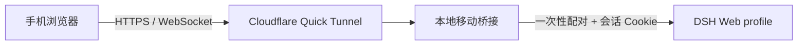
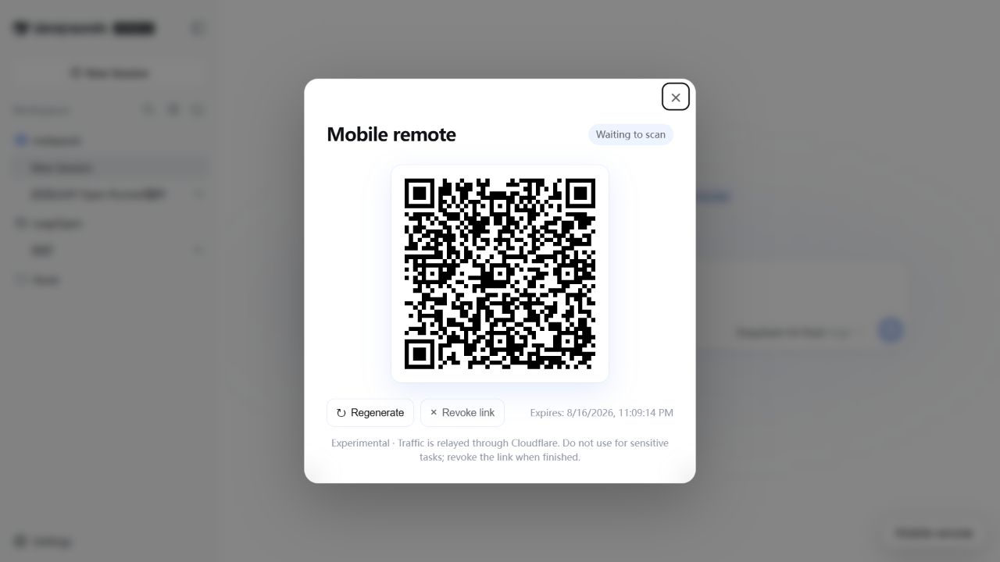
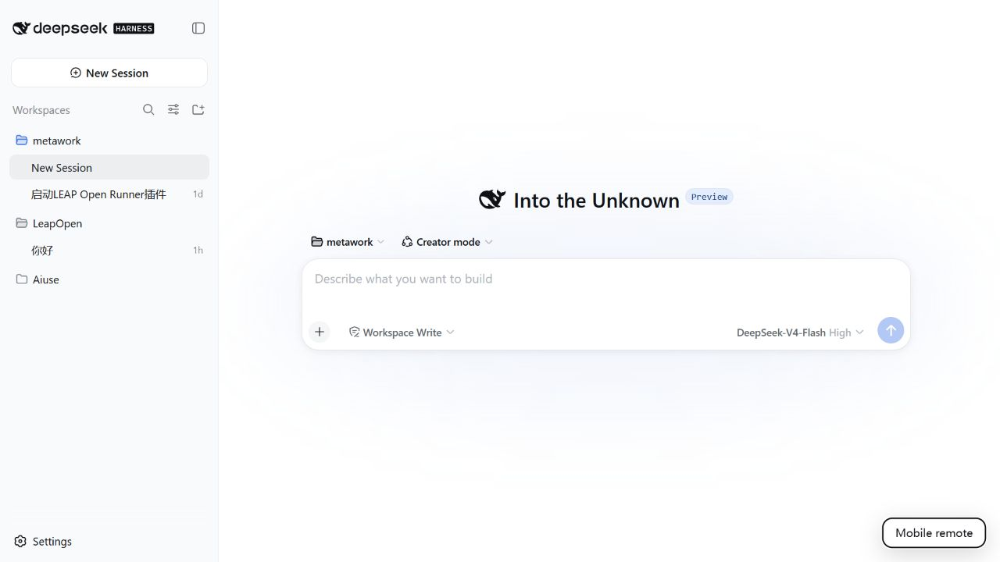

<p align="center"></p>

# DSH Mobile Web Remote

**扫码即用，无需安装手机 App。**

[English](README.en.md) · [安装指南](#安装) · [DSHFind](https://dshfind.com/)

DSH Mobile Web Remote 是面向 DeepSeek Harness（DSH）Web profile 的非侵入式远程访问插件。它在本机建立带鉴权的移动桥接服务，再通过 Cloudflare Quick Tunnel 提供临时 HTTPS 入口。手机端无需安装 APK，扫描电脑端二维码即可继续使用 DSH 原生会话界面。

> [!WARNING]
> 本项目属于实验性功能。Quick Tunnel 的流量由 Cloudflare 中转，临时域名也不具备长期稳定性。请勿处理密钥、客户数据等敏感任务；使用后应立即撤销链接。长期运行时，建议改用可审计的 Named Tunnel，并继续保留本插件的鉴权层。

## 设计边界

本插件不修改 DSH 源码、构建产物或原生工作区选择器。它只使用 DSH 的插件组合、`webServer` 路由与 `tapIndex` 扩展点：电脑端增加一个悬浮入口，远程端复用原生 Web 界面。卸载插件并重启 DSH 后，新增路由和界面元素随插件生命周期一并移除。



- 一次性配对令牌位于 URL Fragment，不随初次 HTTP 请求进入代理日志。
- 配对成功后签发 `HttpOnly`、`SameSite=Strict` 会话 Cookie。
- HTTP 与 WebSocket 共用同一鉴权边界，并校正转发时的 Host 与 Origin。
- DSH 退出或插件卸载时，桥接端口与 `cloudflared` 子进程会被回收。
- 弹窗、悬浮入口与远程界面跟随 DSH 的中英文和深浅主题。
- 远程端隐藏“添加工作区”和“设置”；请先在电脑端建立工作区，再从手机进入现有会话。

## 界面

<p align="center"></p>

入口附着在原生 DSH 页面，不会打开额外标签页：

<p align="center"></p>

## 安装

### 前置条件

- 已能正常启动 DSH 的 Web profile。
- 已安装 Node.js 与 pnpm（从 DSH 源码运行时通常已经具备）。
- 已安装 [`cloudflared`](https://developers.cloudflare.com/cloudflare-one/connections/connect-networks/downloads/)，且命令位于 `PATH`；也可以在插件配置中设置 `cloudflaredPath`。

### 从 GitHub 安装

在 DSH 源码仓库中执行：

```powershell
pnpm dsh plugin --profile web add "github:SnowfallC/dsh-mobile-web-remote"
pnpm dsh web
```

### 从本地目录安装

```powershell
git clone https://github.com/SnowfallC/dsh-mobile-web-remote.git
cd deepseek-harness
pnpm dsh plugin --profile web add "C:/path/to/dsh-mobile-web-remote"
pnpm dsh web
```

## 使用

1. 在电脑端打开 DSH，点击右下角“手机远程 / Mobile remote”。
2. 等待 Quick Tunnel 建立并显示二维码。
3. 使用手机系统相机或浏览器扫码。配对链接默认在 15 分钟后失效，且只能成功配对一次。
4. 在手机上进入已有工作区与会话，继续发送消息或查看执行状态。
5. 结束后点击“撤销链接 / Revoke link”。如需重新配对，先撤销，再生成新的二维码。

管理页也可从本机访问：`http://127.0.0.1:3080/__dsh_mobile`。

## 配置

默认配置位于 `cordis.patch.yml`：

```yaml
config:
  cloudflaredPath: cloudflared
  pairingTtlMinutes: 15
  sessionTtlHours: 12
  bridgePort: 0
```

`bridgePort: 0` 表示由操作系统分配空闲本地端口。也可以通过环境变量 `DSH_CLOUDFLARED_PATH` 指定可执行文件位置。

## 卸载

```powershell
pnpm dsh plugin --profile web remove dsh-mobile-web-remote
```

随后重启 DSH。插件不会在 DSH 内核仓库中留下补丁。

## 开发与验证

```powershell
pnpm install
pnpm check
pnpm test
```

## 友情链接

- [DSHFind — DSH 生态项目索引](https://dshfind.com/)

## 许可

代码采用 [MIT License](LICENSE) 发布。仓库头图属于社区角色的 AI 衍生创作，不纳入 MIT 授权；详见 [ASSET_LICENSE.md](ASSET_LICENSE.md)。
